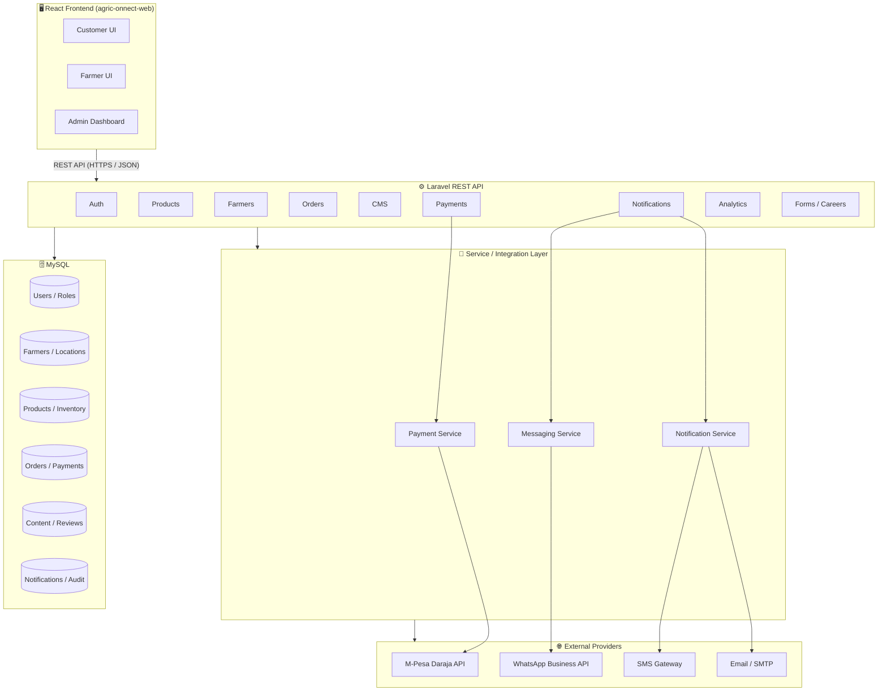

# 🏛️ Architecture Overview

High-level layered architecture of AgriConnect: React frontend → Laravel REST API → MySQL, with third-party integrations isolated behind service interfaces.

## Layer responsibilities

| Layer | Responsibility |
|---|---|
| **React Frontend** | Presentation, routing, state management, form validation, calling the REST API |
| **Laravel API** | Authentication/authorization, business logic, validation, request/response shaping |
| **Service / Integration Layer** | Encapsulates external providers (M-Pesa, WhatsApp, SMS, Email) behind stable interfaces so providers can be swapped without touching business logic |
| **MySQL** | Relational persistence, referential integrity, transactions |
| **External Providers** | M-Pesa Daraja (payments), WhatsApp Business API, SMS gateway, SMTP/Email |

## Design principles

- **Separation of concerns** — frontend and backend are independently deployable.
- **Interface-driven integrations** — every third-party dependency (payments, messaging) sits behind an interface/service contract (see `Services/` in the backend structure), enabling future migration to a microservice per domain (see [Scalability Strategy](../../README.md#-scalability-strategy)).
- **Stateless API** — token-based authentication (JWT/Sanctum) allows horizontal scaling of the API tier.
- **Single database today, service-ready tomorrow** — the schema is modular enough that Products, Orders, Payments, and Notifications could each be extracted into their own service and database in a future phase.

Related: [System Context](system-context.md) · [ERD](../database/erd.md) · [Order Flow](../diagrams/order-flow.md) · [Payment Flow](../diagrams/payment-flow.md) · [Authentication Flow](../diagrams/authentication-flow.md)
