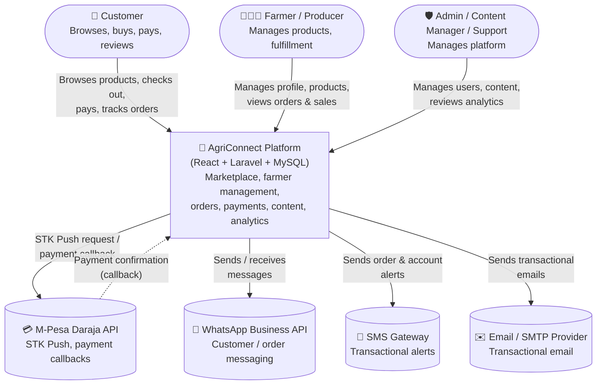

# 🌍 System Context Diagram

C4-style **System Context** view: who and what interacts with AgriConnect, at the highest level of abstraction (no internal components shown).

## Actors

| Actor | Role | Interacts via |
|---|---|---|
| **Customer** | Browses, buys, pays via M-Pesa, tracks orders, leaves reviews | React web app |
| **Farmer / Producer** | Registers, manages profile/locations, lists products, views orders & sales analytics | React web app (farmer portal) |
| **Admin / Content Manager / Support Agent** | Manages users, farmers, products, orders, CMS content, careers, forms, and views analytics | React admin dashboard |

## External systems

| System | Purpose | Direction |
|---|---|---|
| **M-Pesa Daraja API** | STK Push payment initiation and asynchronous payment confirmation callbacks | Outbound request / inbound callback |
| **WhatsApp Business API** | Enquiries, order communication, automated notifications | Outbound (and inbound webhook for replies) |
| **SMS Gateway** | Order/registration/payment alerts | Outbound |
| **Email / SMTP** | Transactional email (confirmations, receipts, password reset) | Outbound |

Related: [Architecture Overview](architecture-overview.md) · [Authentication Flow](../diagrams/authentication-flow.md)
