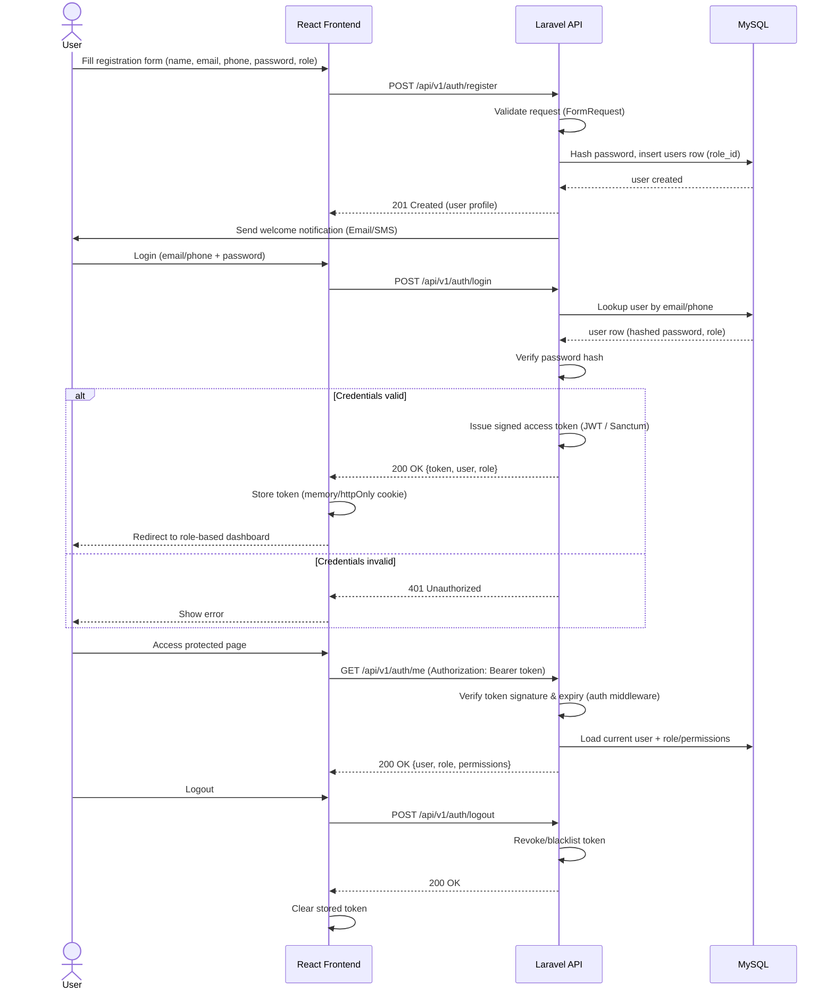
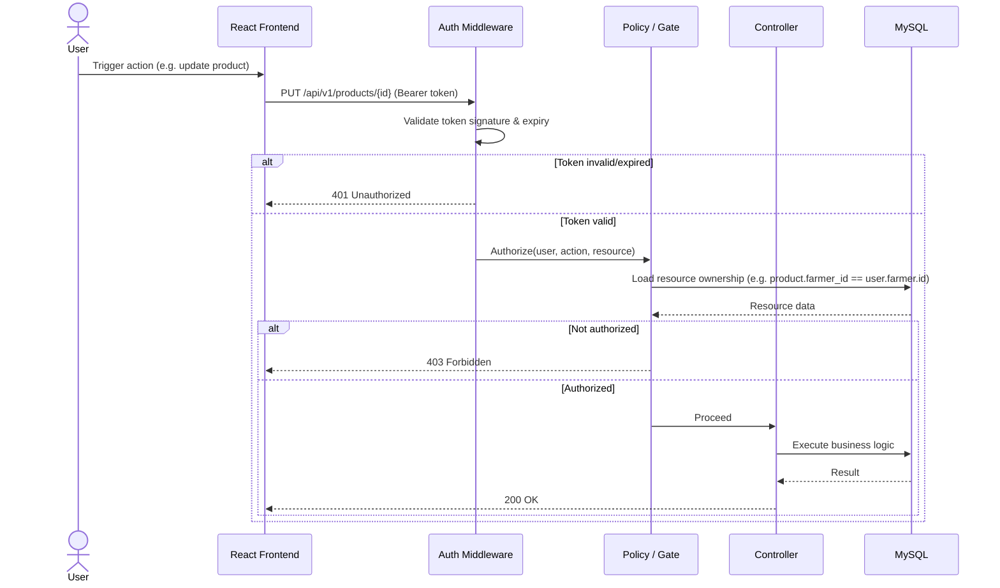
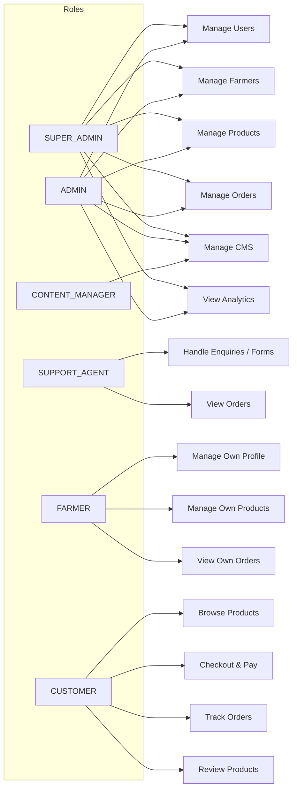

# 🔑 Authentication & Authorization Flow

Token-based authentication and role-based authorization, matching the [README — Authentication & Authorization](../../README.md#-authentication--authorization) endpoints.

## 1. Registration & login sequence



## 2. Request authorization (role-based access control)



## 3. Role → permission matrix



## Endpoints

```text
POST /api/v1/auth/register
POST /api/v1/auth/login
POST /api/v1/auth/logout
GET  /api/v1/auth/me
```

## Security notes

- Passwords are hashed (bcrypt/Argon2) — never stored or logged in plaintext.
- Access tokens are short-lived; refresh/re-authentication is required on expiry.
- Every mutating endpoint passes through both **authentication** (who is this?) and **authorization** (are they allowed to do this, on this specific resource?) — see the Policy/Gate step above.
- Sensitive actions (role changes, payment status overrides) are written to `audit_logs`.

Related: [System Context](../architecture/system-context.md) · [ERD](../database/erd.md) · [Order Flow](order-flow.md)
