# 🗄️ Entity Relationship Diagram (ERD)

Relational model for the core MySQL entities listed in the [README — Core Database Model](../../README.md#-core-database-model).

```mermaid
erDiagram
    ROLES ||--o{ USERS : "assigned to"
    ROLES ||--o{ PERMISSIONS : grants

    USERS ||--o| FARMERS : "has profile"
    USERS ||--o{ ORDERS : places
    USERS ||--o{ CARTS : owns
    USERS ||--o{ REVIEWS : writes
    USERS ||--o{ NOTIFICATIONS : receives
    USERS ||--o{ WHATSAPP_MESSAGES : "sends/receives"
    USERS ||--o{ JOB_APPLICATIONS : submits
    USERS ||--o{ AUDIT_LOGS : "performs (actor)"
    USERS ||--o{ ARTICLES : authors

    FARMERS ||--o{ FARMER_LOCATIONS : has
    FARMERS ||--o{ PRODUCTS : lists

    COUNTIES ||--o{ SUB_COUNTIES : contains
    SUB_COUNTIES ||--o{ WARDS : contains
    WARDS ||--o{ FARMER_LOCATIONS : "located in"

    PRODUCT_CATEGORIES ||--o{ PRODUCTS : classifies
    PRODUCTS ||--o{ PRODUCT_IMAGES : has
    PRODUCTS ||--o| INVENTORIES : "tracked by"
    PRODUCTS ||--o{ CART_ITEMS : "added as"
    PRODUCTS ||--o{ ORDER_ITEMS : "ordered as"
    PRODUCTS ||--o{ REVIEWS : receives
    PRODUCTS ||--o{ RATINGS : receives

    CARTS ||--o{ CART_ITEMS : contains

    ORDERS ||--o{ ORDER_ITEMS : contains
    ORDERS ||--o{ ORDER_STATUS_HISTORY : tracks
    ORDERS ||--o{ PAYMENTS : "paid via"

    PAYMENTS ||--o{ PAYMENT_TRANSACTIONS : records

    JOB_POSTS ||--o{ JOB_APPLICATIONS : receives

    USERS {
        bigint id PK
        string name
        string email
        string phone
        string password_hash
        bigint role_id FK
        timestamp created_at
    }

    ROLES {
        bigint id PK
        string name "SUPER_ADMIN, ADMIN, FARMER, CUSTOMER, CONTENT_MANAGER, SUPPORT_AGENT"
    }

    FARMERS {
        bigint id PK
        bigint user_id FK
        string farm_name
        string bio
        string status
    }

    FARMER_LOCATIONS {
        bigint id PK
        bigint farmer_id FK
        bigint ward_id FK
        decimal latitude
        decimal longitude
    }

    COUNTIES {
        bigint id PK
        string name
    }

    SUB_COUNTIES {
        bigint id PK
        bigint county_id FK
        string name
    }

    WARDS {
        bigint id PK
        bigint sub_county_id FK
        string name
    }

    PRODUCT_CATEGORIES {
        bigint id PK
        bigint parent_id FK "nullable, self-referencing"
        string name
        string slug
    }

    PRODUCTS {
        bigint id PK
        bigint farmer_id FK
        bigint category_id FK
        string name
        text description
        decimal price
        string unit
        string status
        timestamp created_at
    }

    PRODUCT_IMAGES {
        bigint id PK
        bigint product_id FK
        string url
        int sort_order
    }

    INVENTORIES {
        bigint id PK
        bigint product_id FK
        int quantity_available
        int reorder_level
        timestamp updated_at
    }

    CARTS {
        bigint id PK
        bigint user_id FK
        string status
    }

    CART_ITEMS {
        bigint id PK
        bigint cart_id FK
        bigint product_id FK
        int quantity
        decimal unit_price
    }

    ORDERS {
        bigint id PK
        bigint user_id FK
        string status "PENDING..DELIVERED / CANCELLED / REFUNDED"
        decimal total_amount
        string delivery_address
        bigint ward_id FK
        timestamp created_at
    }

    ORDER_ITEMS {
        bigint id PK
        bigint order_id FK
        bigint product_id FK
        int quantity
        decimal unit_price
        decimal line_total
    }

    ORDER_STATUS_HISTORY {
        bigint id PK
        bigint order_id FK
        string status
        string note
        timestamp changed_at
    }

    PAYMENTS {
        bigint id PK
        bigint order_id FK
        string provider "MPESA"
        string status "PENDING, SUCCESS, FAILED"
        decimal amount
        timestamp initiated_at
    }

    PAYMENT_TRANSACTIONS {
        bigint id PK
        bigint payment_id FK
        string mpesa_receipt_number
        string checkout_request_id
        json raw_callback_payload
        timestamp received_at
    }

    REVIEWS {
        bigint id PK
        bigint product_id FK
        bigint user_id FK
        text comment
        string moderation_state
        timestamp created_at
    }

    RATINGS {
        bigint id PK
        bigint review_id FK
        tinyint value "1-5"
    }

    ARTICLES {
        bigint id PK
        bigint author_id FK
        string title
        string slug
        text body
        string status
    }

    PAGES {
        bigint id PK
        string title
        string slug
        text body
    }

    BANNERS {
        bigint id PK
        string title
        string image_url
        string link_url
        boolean is_active
    }

    NOTIFICATIONS {
        bigint id PK
        bigint user_id FK
        string channel "SMS, EMAIL, WHATSAPP, IN_APP"
        string type
        json payload
        timestamp read_at
    }

    WHATSAPP_MESSAGES {
        bigint id PK
        bigint user_id FK
        string direction "INBOUND, OUTBOUND"
        text message
        timestamp sent_at
    }

    JOB_POSTS {
        bigint id PK
        string title
        text description
        string status
    }

    JOB_APPLICATIONS {
        bigint id PK
        bigint job_post_id FK
        bigint user_id FK
        string resume_url
        string status
    }

    CONTACT_FORMS {
        bigint id PK
        string name
        string email
        text message
        timestamp submitted_at
    }

    ENQUIRIES {
        bigint id PK
        string subject
        text message
        string status
    }

    AUDIT_LOGS {
        bigint id PK
        bigint user_id FK
        string action
        string entity_type
        bigint entity_id
        json changes
        timestamp created_at
    }
```

## Notes

- `PERMISSIONS` are attached to `ROLES` (many-to-many via a `role_permission` pivot in practice — simplified to one edge above for readability).
- `PRODUCT_CATEGORIES.parent_id` is self-referencing, enabling nested categories.
- `CONTACT_FORMS` and `ENQUIRIES` are intentionally left unlinked to `USERS` since public visitors (not yet registered) can submit them.
- `PAYMENT_TRANSACTIONS.raw_callback_payload` stores the raw M-Pesa callback JSON for audit/reconciliation (see [Payment Flow](../diagrams/payment-flow.md)).

Related: [Architecture Overview](../architecture/architecture-overview.md) · [Order Flow](../diagrams/order-flow.md)
