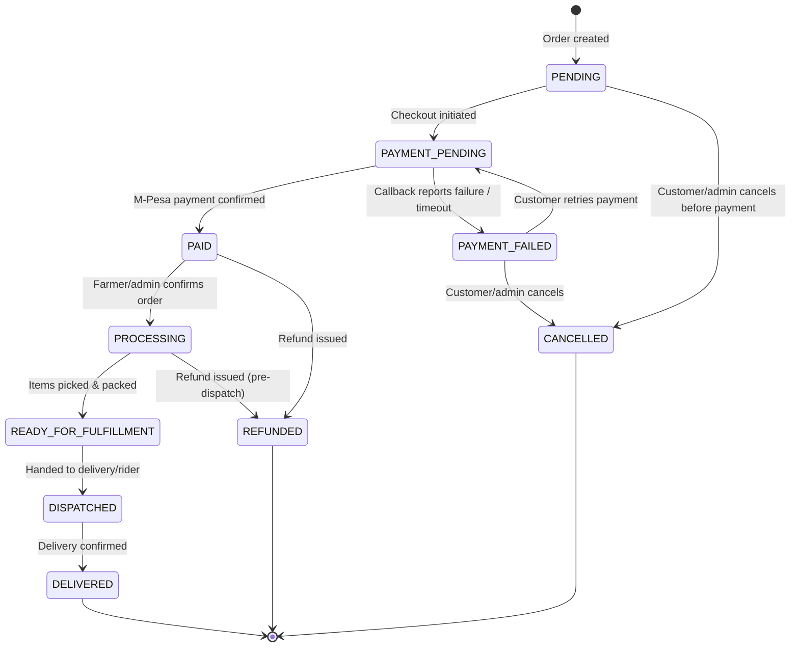
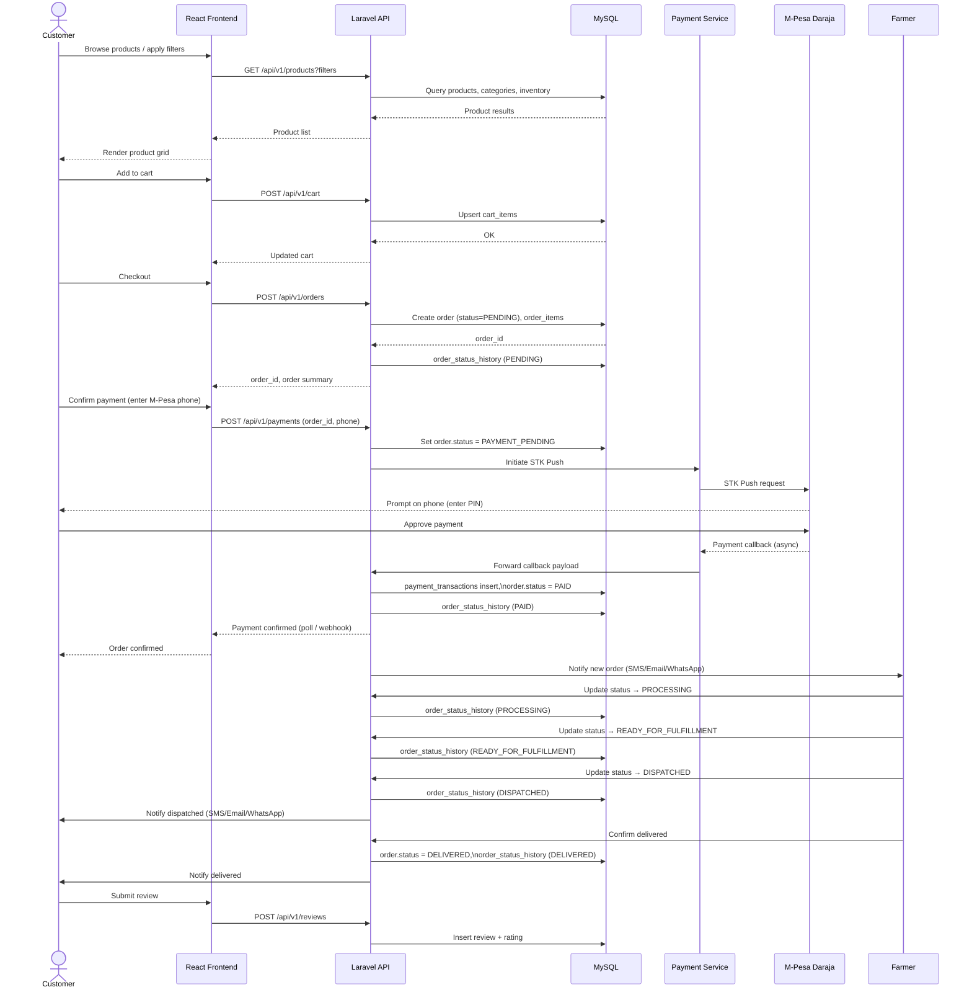

# 📦 Order Flow

Two complementary views: the **order status lifecycle** (state machine) and the **end-to-end sequence** from browsing to delivery.

## 1. Order status state machine

## 2. End-to-end order sequence

## Exception states

| State | Trigger |
|---|---|
| `PAYMENT_FAILED` | M-Pesa callback reports failure, or STK Push request times out |
| `CANCELLED` | Customer cancels before payment, or admin cancels manually |
| `REFUNDED` | Admin issues a refund on a paid order that must not proceed |

Related: [Payment Flow](payment-flow.md) · [ERD](../database/erd.md) · [Architecture Overview](../architecture/architecture-overview.md)
