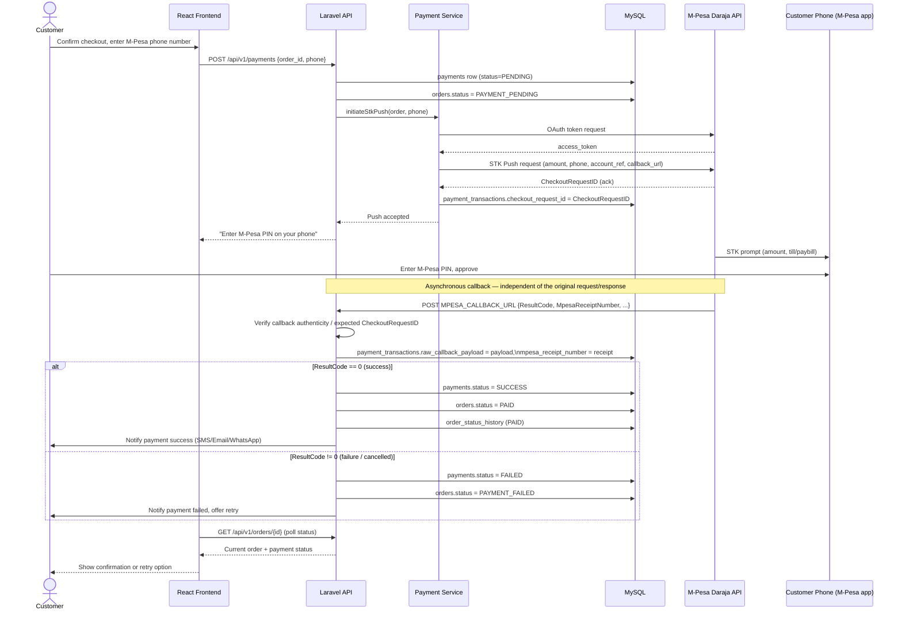
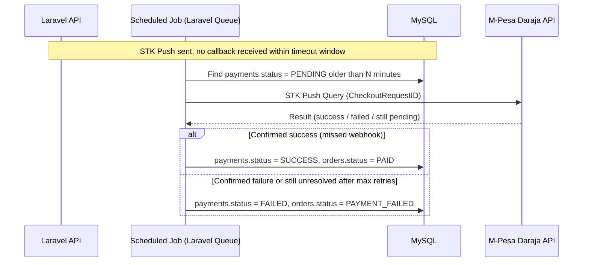

# 💳 M-Pesa Payment Flow (STK Push)

Detailed sequence for the M-Pesa payment workflow referenced in the [README — M-Pesa Integration](../../README.md#-m-pesa-integration), including callback handling and reconciliation.

## 1. Happy path — STK Push, callback, reconciliation

## 2. Timeout / no-callback handling

## Key safeguards

| Concern | Mitigation |
|---|---|
| **Callback authenticity** | Validate the callback originates from a trusted M-Pesa IP/URL and matches a known `CheckoutRequestID` before mutating order state |
| **Idempotency** | A callback for an already-`SUCCESS` payment is a no-op — never double-credit an order |
| **Reconciliation** | Raw callback payload is persisted (`payment_transactions.raw_callback_payload`) for audit and manual reconciliation |
| **Lost/late callbacks** | Scheduled job (STK Push Query API) resolves payments stuck in `PENDING` past a timeout |
| **Order/payment consistency** | `orders.status` is only advanced to `PAID` inside the same DB transaction as the `payments` update |

Related: [Order Flow](order-flow.md) · [ERD](../database/erd.md) · [Authentication Flow](authentication-flow.md)
